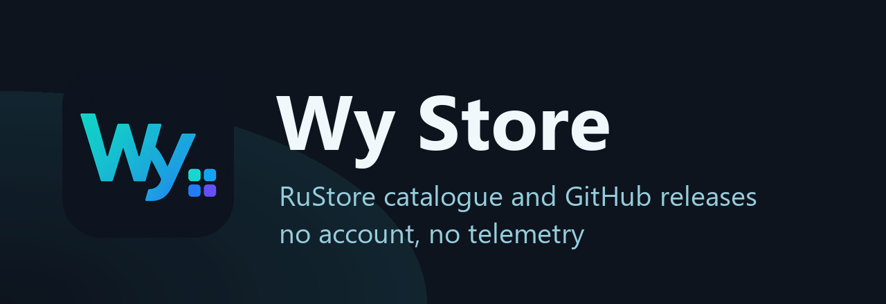
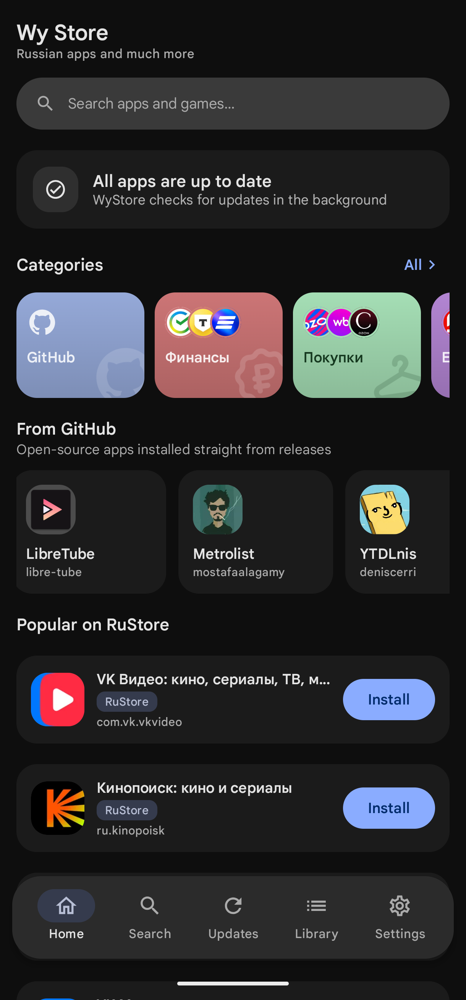
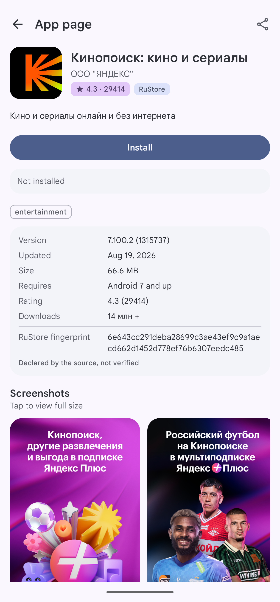
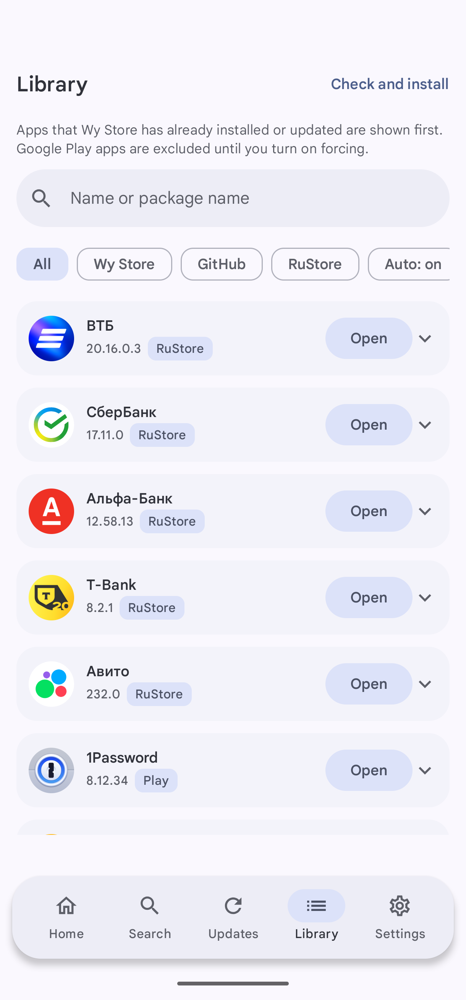

<div align="center">



**An Android store client with no account, no backend and no telemetry**

[](https://github.com/wyrtensi/wystore/releases/latest)

[](https://github.com/wyrtensi/wystore/releases/latest)
[](https://github.com/wyrtensi/wystore/actions/workflows/build.yml)
[](https://github.com/wyrtensi/wystore/releases)
[](#requirements)
[](https://t.me/+_YytpJdDHgQ4OTYy)
[](LICENSE)

[Русский](README.md) · [All releases](https://github.com/wyrtensi/wystore/releases) · [Project statement](DISCLAIMER.md) · [Licence](LICENSE)

</div>

It browses the RuStore catalogue, tracks releases of curated GitHub projects, verifies every APK
before it is installed, and keeps installed apps up to date in the background.

**Wy Store is an independent alternative client for the RuStore catalogue.** It reads the same public
pages the rustore.ru site serves, but installs apps itself through Android's own package installer,
and needs neither an account nor the RuStore client to be present. The project is not affiliated with
RuStore, not endorsed by it, and does not act on its behalf; RuStore is a data source here, not a
partner. GitHub releases are the second source, which is how Wy Store also covers what RuStore does
not carry.

The catalogue and the curated sections are aimed at users in Russia, so most of the content the app
displays is in Russian; the interface itself ships in Russian and English.

> **It gets along with root.** Without root Wy Store does everything it does, except that Android
> confirms every install. With root it handles the whole thing itself: the update downloads in the
> background and goes in through `pm install` with no dialog at all - and the same signature check
> as always. Both switches sit in Settings turned off until you turn them on and root is actually
> granted.

> **Android 8.0 is Wy Store's own minimum, not the catalogue's.** Plenty of apps in the catalogues
> need something newer - 9, 10, sometimes 12 or 13. Each app's page states the version it needs, and
> if the device cannot run it Wy Store says so before the download rather than after two hundred
> megabytes.

| Home | App page | Library |
|---|---|---|
|  |  |  |

## Install

1. Download `wystore-<version>.apk` from the [latest release](https://github.com/wyrtensi/wystore/releases/latest).
2. Open the file. Android asks once for permission to install from this source.
3. After that Wy Store updates itself: it watches the releases in this repository and installs them
   through the same signature check as any other app.

The APK is signed with a permanent key whose fingerprint CI prints on every publish. To check the
file you downloaded:

```bash
apksigner verify --print-certs wystore-<version>.apk
```

## What it does

**Two sources, one list.** RuStore listings and a built-in catalogue of GitHub projects appear side
by side in search and on the home screen, each labelled with where it came from. Any public GitHub
repository can be added by URL; releases are picked by policy, so rolling nightly tags and releases
without an installable APK are skipped rather than offered.

**Verification before installation.** Every downloaded APK set is checked for a single base APK, a
consistent package name and version code across splits, a readable signature, and — when the app is
already installed — the same signing certificate and a version code that actually moves forward. A
set that fails any of these is rejected with a reason, not installed.

**A queue that survives a reboot.** The download queue lives in a database, not in memory. A
download interrupted by a reboot, a killed process or a lost network resumes from where it stopped
with an HTTP range request rather than starting over, and a failure is recorded with a typed reason
instead of an exception message.

**Installation on your terms.** By default every install goes through Android's own confirmation
dialog. On a rooted device silent installation is available, but it is off unless you turn it on and
root is actually granted.

**Fully automatic updates on a rooted device.** Two switches in Settings close the loop with no
interaction at all: the periodic check finds an update, downloads it in the background straight
away, and installs it silently.

- *Download updates in background (root)* — a discovered update starts downloading by itself. The
  download honours the network you chose: with "Wi-Fi only" it waits for Wi-Fi rather than spending
  mobile data, and with "only while charging" it waits for the charger.
- *Silent root install* — the downloaded and verified update is installed through `pm install` as
  root, without the system dialog.

The checks are unchanged: package name, version code, APK-set completeness and signature match. A
silent install weakens none of them — an APK with a different signature is refused here too. If root
is not actually granted, both switches do nothing: without root a silent install is impossible, and
downloading ahead of time would be pointless because the install needs confirmation anyway.

**Notifications that stay quiet.** At most one notification per category. Twenty updates produce one
entry listing them, not twenty; a repeated background check that finds the same updates re-posts
silently instead of alerting again; and quiet hours keep everything soundless inside a window you
choose.

**Background work that respects the battery.** Periodic checks run in a flexible window so the
system can batch them with other wake-ups, stand down under battery saver, and are not scheduled at
all while nothing has been adopted.

**It updates itself.** Wy Store checks its own releases in this repository and installs them through
the same queue, with the same signature check, as any other app.

## Security model

- Installation starts only from an explicit press of an install or update button.
- Package name, version code, APK-set completeness and signing certificate are checked before every
  install. A signature that does not match the installed copy is a refusal, never a warning.
- Downloads are restricted to an allowlist of hosts, with redirects resolved explicitly rather than
  followed blind.
- Apps installed by Google Play are left alone until the per-app override is switched on.
- Verified APKs stay in the app's private storage until the install is confirmed, and are pruned
  under retention and storage limits you control.
- No account, no analytics, no advertising SDK, no server of the project's own.

Wy Store verifies distribution. It does not review the applications themselves, and every install
page names the source so responsibility sits with it.

The project hosts nothing: it has no servers, and APKs are downloaded straight from `rustore.ru` and
`github.com` using links those services publish themselves. The client identifies itself as
`WyStore/<version>` rather than posing as the official one, has no account and never creates a
RuStore `User-Token`. Details and the statement of independence are in [DISCLAIMER.md](DISCLAIMER.md).

## Source limitations

The RuStore endpoints the app uses are public web endpoints, not a supported consumer API. The
integration is isolated in `RuStoreSource`, and a change upstream surfaces as a source-format error
rather than as corrupted data. The client uses a bounded `ruStoreVerCode` compatibility fallback and
never creates or copies a RuStore `User-Token`. Free, current-version applications are supported.

The endpoints, the HTTP 419 root cause, the official-APK version conversion and the fallback
behaviour are documented in [docs/RUSTORE_API_COMPATIBILITY_RU.md](docs/RUSTORE_API_COMPATIBILITY_RU.md)
(in Russian).

## Requirements

- Android 8.0 (API 26) or newer - that is Wy Store's own requirement; apps from the catalogues
  often need something newer, and each app's page states which version
- Permission to install unknown apps, which Android asks for on the first install
- Root is optional: without it everything works except installing with no dialogs
- Small screens: the layout is tested on an Asus Zenfone 10 as well as on a large phone

## Build

JDK 17 or newer and Android SDK Platform 36.

```bash
./gradlew :app:assembleDebug
```

The debug APK is written to `app/build/outputs/apk/debug/app-debug.apk`.

Tests:

```bash
./gradlew :app:testDebugUnitTest
```

Instrumented tests, with a device or emulator attached:

```bash
./gradlew :app:connectedDebugAndroidTest
```

### Release signing

Releases are signed with a fixed key. Because the signature check applies to Wy Store itself, a build
you compiled locally cannot be updated in place by a published release, and the reverse is also true
— the two are different applications as far as Android is concerned.

Create the key (keytool asks for the password interactively, so it never appears in a command):

```bash
keytool -genkeypair -v -keystore outputs/wystore-release.jks -alias wystore -keyalg RSA -keysize 4096 -validity 10000
```

Signing material is read from `keystore.properties` at the repository root (gitignored; template in
[keystore.properties.example](keystore.properties.example)) or from the environment variables
`WYSTORE_KEYSTORE`, `WYSTORE_KEYSTORE_PASSWORD`, `WYSTORE_KEY_ALIAS` and `WYSTORE_KEY_PASSWORD`.
All four are required: with any of them missing the release build stays unsigned rather than
silently falling back to the debug key.

### Publishing

Write the entry in [CHANGELOG.md](CHANGELOG.md) under the new version first, then tag. The release
notes on GitHub are taken from that section, and a tag without one fails the build rather than
publishing a list of commit subjects.

CI builds a release from a tag, see [.github/workflows/release.yml](.github/workflows/release.yml):

```bash
git tag v0.1.17 && git push origin v0.1.17
```

That needs `WYSTORE_KEYSTORE_BASE64` (the keystore file, base64-encoded), `WYSTORE_KEYSTORE_PASSWORD`,
`WYSTORE_KEY_ALIAS` and `WYSTORE_KEY_PASSWORD` in the repository secrets. The workflow verifies that
the APK really is signed and fails if it is not, so a build nobody could install never gets
published.

A signing key held in CI secrets is reachable by anyone who can change a workflow in this
repository. If that is not acceptable, build the release locally and upload the APK by hand.

## Project layout

| Path | What lives there |
|---|---|
| `app/src/main/java/dev/wystore/data` | Sources, catalogue, models, APK verification |
| `app/src/main/java/dev/wystore/updates` | Durable queue, install flow, schedulers |
| `app/src/main/java/dev/wystore/background` | Workers, notification and battery policy |
| `app/src/main/java/dev/wystore/selfupdate` | Wy Store's own update check |
| `app/src/main/java/dev/wystore/localization` | Typed error codes rendered into text |
| `app/src/main/java/dev/wystore/ui` | Compose screens, theme, shared components |
| `app/src/test` | Unit tests, including HTML fixtures captured from the source |
| `app/src/androidTest` | Instrumented tests |

## Licence

MIT. See [LICENSE](LICENSE).
