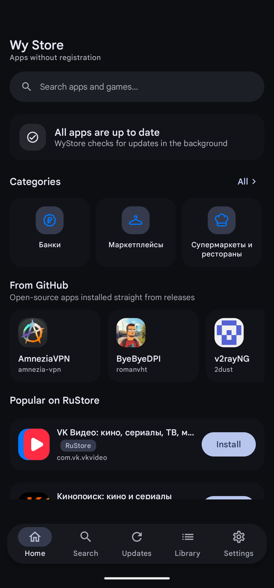
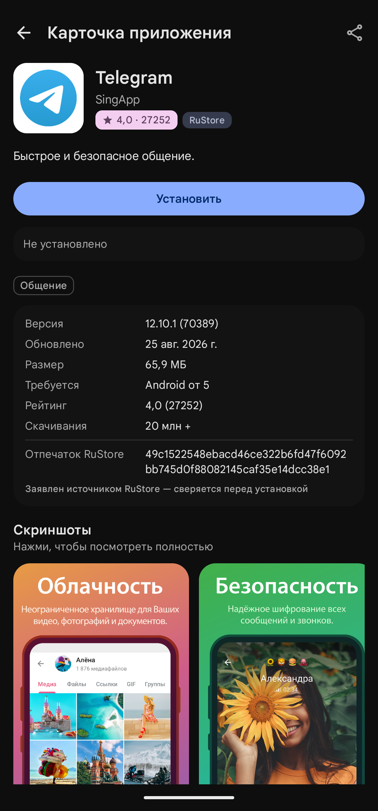
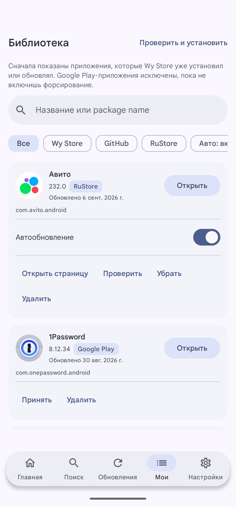

<div align="center">


# Wy Store

**Магазин приложений для Android без аккаунта, без сервера и без телеметрии**

[](https://github.com/wyrtensi/wystore/releases/latest)

[](https://github.com/wyrtensi/wystore/releases/latest)
[](https://github.com/wyrtensi/wystore/actions/workflows/build.yml)
[](https://github.com/wyrtensi/wystore/releases)
[](#требования)
[](LICENSE)

[English](README.en.md) · [Все релизы](https://github.com/wyrtensi/wystore/releases) · [Заявление о проекте](DISCLAIMER.md) · [Лицензия](LICENSE)

</div>

Показывает каталог RuStore, следит за релизами отобранных проектов на GitHub, проверяет каждый APK
перед установкой и обновляет установленное в фоне.

**Wy Store — независимый альтернативный клиент для каталога RuStore.** Он читает те же публичные
страницы, что и сайт rustore.ru, но ставит приложения сам, через системный установщик Android, и не
требует ни аккаунта, ни установленного клиента RuStore. Проект не связан с RuStore, не одобрен им и
не действует от его имени; RuStore здесь — источник данных, а не партнёр. Вторым источником идут
релизы с GitHub, поэтому Wy Store закрывает и то, чего в RuStore нет.

Wy Store сделан для тех, у кого привычные магазины не работают, и кто предпочитает видеть, что
именно делает приложение, а не верить ему на слово.

| Главная | Страница приложения | Библиотека |
|---|---|---|
|  |  |  |

## Установка

1. Скачайте `wystore-<версия>.apk` из [последнего релиза](https://github.com/wyrtensi/wystore/releases/latest).
2. Откройте файл. Android один раз спросит разрешение на установку из этого источника.
3. Дальше Wy Store обновляет себя сам: он следит за релизами в этом репозитории и ставит их через
   ту же проверку подписи, что и любое другое приложение.

APK подписан постоянным ключом, отпечаток которого печатает CI при каждой публикации. Проверить
скачанный файл можно так:

```bash
apksigner verify --print-certs wystore-<версия>.apk
```

## Что умеет

**Два источника в одном списке.** Карточки RuStore и встроенный каталог проектов с GitHub идут
рядом в поиске и на главной, каждая подписана источником. Любой публичный репозиторий добавляется
ссылкой. Релиз выбирается по правилам: катящиеся nightly-теги и релизы без пригодного APK
пропускаются, а не предлагаются.

**Проверка до установки, а не после.** Каждый скачанный комплект APK проверяется на единственный
базовый APK, совпадение имени пакета и versionCode во всех split-частях, читаемую подпись, а для
уже установленного приложения — на тот же сертификат подписи и на versionCode, который
действительно растёт. Комплект, не прошедший любую из проверок, отклоняется с указанием причины, а
не устанавливается.

**Очередь, которая переживает перезагрузку.** Очередь загрузок лежит в базе, а не в памяти.
Загрузка, прерванная перезагрузкой, убитым процессом или потерянной сетью, продолжается с того
места, где остановилась — по HTTP Range, а не с нуля. Отказ записывается типизированным кодом, а не
текстом исключения.

**Установка на ваших условиях.** По умолчанию каждая установка проходит через системный диалог
Android. На устройстве с root доступна тихая установка, но она выключена, пока вы её не включите и
root действительно не выдан.

**Полностью автоматические обновления на устройстве с root.** Двумя переключателями в настройках
цепочка замыкается целиком, без единого касания: периодическая проверка находит обновление, сразу же
скачивает его в фоне и устанавливает молча.

- *Скачивать обновления в фоне (root)* — найденное обновление начинает качаться само. Загрузка
  уважает выбранную сеть: при «только Wi-Fi» она дождётся Wi-Fi, а не потратит мобильный трафик, и
  при включённом «только при зарядке» дождётся зарядника.
- *Тихая root-установка* — скачанное и проверенное обновление ставится через `pm install` от root,
  без системного диалога.

Проверки при этом те же самые: имя пакета, versionCode, полнота комплекта APK и совпадение подписи.
Тихая установка не ослабляет ни одну из них — APK с чужой подписью будет отклонён и здесь. Если root
не выдан фактически, оба переключателя не делают ничего: без root тихо установить нельзя, а качать
заранее незачем, потому что установка всё равно потребует подтверждения.

**Уведомления, которые молчат.** Не больше одного уведомления на категорию. Двадцать обновлений
дают одну запись со списком, а не двадцать. Повторная фоновая проверка с тем же результатом
перепубликует запись беззвучно. Тихие часы делают беззвучным всё внутри выбранного окна.

**Фон, который щадит батарею.** Периодические проверки идут с гибким окном, чтобы система
объединяла их с другими пробуждениями, не выполняются в режиме энергосбережения и вовсе не
планируются, пока не добавлено ни одного приложения.

**Обновляет сам себя.** Wy Store проверяет собственные релизы в этом репозитории и ставит их через
ту же очередь и ту же проверку подписи, что и любое другое приложение.

## Модель безопасности

- Установка начинается только по явному нажатию кнопки установки или обновления.
- Перед каждой установкой проверяются имя пакета, versionCode, полнота комплекта APK и сертификат
  подписи. Несовпадение подписи с установленной копией — это отказ, а не предупреждение.
- Загрузки ограничены списком разрешённых хостов, перенаправления разбираются явно, а не следуются
  вслепую.
- Приложения, установленные из Google Play, не трогаются, пока не включён отдельный переключатель
  для конкретного приложения.
- Проверенные APK лежат в приватном хранилище приложения до подтверждения установки и удаляются по
  вашим настройкам срока хранения и лимита места.
- Ни аккаунта, ни аналитики, ни рекламных SDK, ни собственного сервера у проекта нет.

Wy Store проверяет доставку. Он не проверяет сами приложения, и каждая страница установки называет
источник, чтобы ответственность оставалась за ним.

Проект ничего не хостит: своих серверов у него нет, APK скачиваются напрямую с `rustore.ru` и
`github.com` по ссылкам, которые эти сервисы публикуют сами. Клиент представляется как
`WyStore/<версия>` и не выдаёт себя за официальный, не заводит аккаунт и не создаёт `User-Token`
RuStore. Подробности и заявление о независимости — в [DISCLAIMER.md](DISCLAIMER.md).

## Ограничения источника

Эндпоинты RuStore, которые использует приложение, — это публичные веб-эндпоинты, а не поддерживаемое
клиентское API. Интеграция изолирована в `RuStoreSource`, и изменение на стороне источника
проявляется как ошибка формата, а не как испорченные данные. Клиент использует ограниченный запасной
вариант `ruStoreVerCode` и никогда не создаёт и не копирует `User-Token` RuStore. Поддерживаются
бесплатные приложения в текущей версии.

Эндпоинты, причина HTTP 419, преобразование версии официального APK и поведение запасного варианта
описаны в [docs/RUSTORE_API_COMPATIBILITY_RU.md](docs/RUSTORE_API_COMPATIBILITY_RU.md).

## Требования

- Android 8.0 (API 26) или новее
- Разрешение на установку неизвестных приложений — Android запросит его при первой установке
- Root не обязателен и нужен только для тихой установки

## Сборка

JDK 17 или новее и Android SDK Platform 36.

```bash
./gradlew :app:assembleDebug
```

Debug-APK появится в `app/build/outputs/apk/debug/app-debug.apk`.

Тесты:

```bash
./gradlew :app:testDebugUnitTest
```

Инструментальные тесты, с подключённым устройством или эмулятором:

```bash
./gradlew :app:connectedDebugAndroidTest
```

### Подпись релиза

Релизы подписываются постоянным ключом. Проверка подписи распространяется и на сам Wy Store, поэтому
собранная вами локально сборка не обновится опубликованным релизом, и наоборот: для Android это
разные приложения.

Создать ключ (пароль `keytool` спросит сам, в команде его писать не нужно):

```bash
keytool -genkeypair -v -keystore outputs/wystore-release.jks -alias wystore -keyalg RSA -keysize 4096 -validity 10000
```

Данные для подписи берутся из `keystore.properties` в корне репозитория (файл в `.gitignore`,
шаблон — [keystore.properties.example](keystore.properties.example)) или из переменных окружения
`WYSTORE_KEYSTORE`, `WYSTORE_KEYSTORE_PASSWORD`, `WYSTORE_KEY_ALIAS`, `WYSTORE_KEY_PASSWORD`.
Нужны все четыре значения: при нехватке любого release-сборка остаётся неподписанной, а не
подписывается debug-ключом молча.

### Публикация

Порядок такой: сначала запись в [CHANGELOG.md](CHANGELOG.md) под номером новой версии, потом тег.
Текст релиза на GitHub берётся из этого раздела, и тег без записи роняет сборку — чтобы релиз не
уехал со списком заголовков коммитов вместо описания.

Релиз собирает CI по тегу — [.github/workflows/release.yml](.github/workflows/release.yml):

```bash
git tag v0.1.17 && git push origin v0.1.17
```

Для этого в секретах репозитория должны лежать `WYSTORE_KEYSTORE_BASE64` (файл ключа в base64),
`WYSTORE_KEYSTORE_PASSWORD`, `WYSTORE_KEY_ALIAS` и `WYSTORE_KEY_PASSWORD`. Workflow проверяет, что
APK действительно подписан, и падает, если нет, — чтобы не выложить сборку, которая ни у кого не
установится.

Ключ подписи в секретах CI доступен любому, кто может изменить workflow в этом репозитории. Если это
неприемлемо, собирайте релиз локально и загружайте APK вручную.

## Структура проекта

| Путь | Что там |
|---|---|
| `app/src/main/java/dev/wystore/data` | Источники, каталог, модели, проверка APK |
| `app/src/main/java/dev/wystore/updates` | Долговечная очередь, установка, планировщики |
| `app/src/main/java/dev/wystore/background` | Воркеры, политика уведомлений и батареи |
| `app/src/main/java/dev/wystore/selfupdate` | Проверка обновлений самого Wy Store |
| `app/src/main/java/dev/wystore/localization` | Перевод типизированных кодов ошибок в текст |
| `app/src/main/java/dev/wystore/ui` | Экраны на Compose, тема, общие компоненты |
| `app/src/test` | Юнит-тесты, включая HTML-фикстуры, снятые с источника |
| `app/src/androidTest` | Инструментальные тесты |

## Лицензия

MIT, см. [LICENSE](LICENSE).
