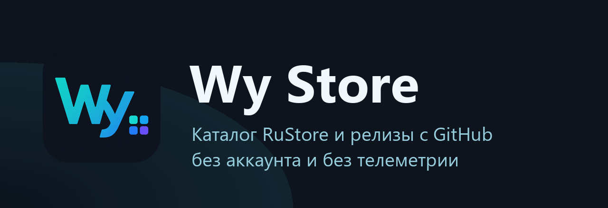

<div align="center">



**Альтернатива RuStore без стеження та реклами**

[](https://github.com/wyrtensi/wystore/releases/latest/download/wystore.apk)
[](https://github.com/wyrtensi/wystore/releases)

[](https://github.com/wyrtensi/wystore/releases/latest)
[](https://github.com/wyrtensi/wystore/actions/workflows/build.yml)
[](#вимоги)
[](https://t.me/+_YytpJdDHgQ4OTYy)
[](LICENSE)

[Сайт проекту](https://wystore.ru/uk/)

[Русский](README.md) · [English](README.en.md) · **Українська** · [Беларуская](README.be.md) · [Қазақша](README.kk.md) · [Oʻzbekcha](README.uz.md) · [Latviešu](README.lv.md) · [简体中文](README.zh.md)

[Релізи](https://github.com/wyrtensi/wystore/releases) · [Історія змін](CHANGELOG.md) · [Конфіденційність](PRIVACY.md) · [Безпека](SECURITY.md) · [Заява про проєкт](DISCLAIMER.md) · [Ліцензія](LICENSE)

</div>

Wy Store — клієнт каталогу RuStore для Android. Він показує ті самі застосунки, що й магазин
застосунків RuStore, але завантажує та встановлює їх сам, через системний інсталятор, і не потребує
ні акаунта, ні встановленого клієнта RuStore. Другим джерелом ідуть релізи з GitHub — так у списку
опиняється і те, чого в RuStore немає.

У проєкту немає власного сервера, акаунтів, аналітики та реклами. Застосунок звертається лише до
`rustore.ru`, `github.com` і сховищ, з яких ці сервіси самі роздають файли.

Wy Store не пов'язаний з RuStore і не діє від його імені: RuStore тут — джерело даних.
Подробиці — у [DISCLAIMER.md](DISCLAIMER.md).

| Головна | Сторінка застосунку | Бібліотека |
|---|---|---|
|  |  |  |

[Розбір за екранами](https://telegra.ph/Wy-Store-magazin-prilozhenij-kotoryj-ne-prosit-vojti-v-akkaunt-09-09) — як застосунок виглядає в роботі та що в ньому працює не завжди (російською).

## Можливості

- **Два джерела в одному списку.** Картки RuStore і релізи відібраних проєктів з GitHub ідуть
  поруч у пошуку, на головній та в розділах; у кожної підписано джерело. Власний публічний
  репозиторій додається посиланням.
- **Розділи каталогу.** Розділи RuStore — плитками на головній і окремим екраном з усіма
  розділами. У налаштуваннях можна перемкнутися на власний набір розділів Wy Store.
- **Перевірка APK до встановлення.** Ім'я пакета, versionCode, повнота комплекту split-APK і
  сертифікат підпису звіряються перед тим, як файл піде в інсталятор. Розбіжність — відмова із
  зазначенням причини.
- **Оновлення у фоні.** Перевірка за розкладом і автозавантаження знайденого. Встановлення без
  діалогу можливе на Android 12 і новіших для того, що Wy Store поставив сам, — але не
  гарантоване: подробиці нижче.
- **Черга завантажень.** Зберігається в базі, переживає перезавантаження та обрив мережі, продовжує
  завантаження з перерваного місця по HTTP Range.
- **Відгуки та оцінки.** Для застосунків RuStore — рейтинг, розбивка за кількістю зірок і фільтр за
  оцінкою.
- **Бібліотека.** Встановлені застосунки з фільтрами за джерелом; оновлення та видалення з одного
  списку.
- **Резервна копія.** Експорт та імпорт налаштувань, прийнятих застосунків і доданих репозиторіїв
  одним JSON-файлом.
- **Економія трафіку.** Режим «тільки Wi-Fi» для фонових завантажень; при ручному завантаженні
  через мобільний інтернет застосунок запитує підтвердження.
- **Інтерфейс.** Русский, English, Українська, Беларуская, Қазақша, Oʻzbekcha, Latviešu, 简体中文.
  Світла й темна тема, Material You.

## Встановлення

1. Завантажте `wystore-<версія>.apk` з
   [останнього релізу](https://github.com/wyrtensi/wystore/releases/latest).
2. Відкрийте файл. Android один раз запитає дозвіл на встановлення з цього джерела.
3. Далі Wy Store оновлює себе сам — він стежить за релізами в цьому репозиторії.

У кожному релізі два файли, `wystore-<версія>.apk` і `wystore.apk`. Це та сама збірка з тим самим
підписом: другий потрібен для постійного посилання `releases/latest/download/wystore.apk`.

APK підписано постійним ключем, відбиток якого CI друкує при кожній публікації. Перевірити
завантажений файл:

```bash
apksigner verify --print-certs wystore-<версія>.apk
```

### Перехід на 0.2.0 з більш ранніх версій

У версії 0.2.0 змінився ідентифікатор застосунку: `dev.wystore` → `app.wystore`. Для Android це
інший застосунок, тому оновлення доведеться поставити вручну, один раз:

1. У старому Wy Store: **Налаштування → Резервна копія та перенесення → Експорт**, збережіть файл.
2. Встановіть новий APK.
3. У новому Wy Store: **Налаштування → Резервна копія та перенесення → Імпорт**, виберіть цей файл.
   Перенесуться налаштування, прийняті застосунки та додані репозиторії GitHub.
4. Видаліть стару версію, інакше два магазини перевірятимуть ті самі застосунки.
5. Надайте новому застосунку виняток з оптимізації батареї та підтвердіть передавання оновлень
   при першому оновленні: обидва дозволи прив'язані до ідентифікатора і не переносяться.

Далі самооновлення працює як раніше.

## Як працюють оновлення

Знайти та завантажити оновлення застосунок вміє сам і завжди. А от поставити його без жодного
натискання виходить не всюди, і це варто пояснити точно, бо підтверджень на шляху два і вони
незалежні.

### Перше: системний інсталятор Android

Починаючи з Android 12 система дозволяє оновлювати застосунок без свого вікна тому, хто цей
застосунок встановив. Умов чотири, і вони виконуються або ні цілком:

- це оновлення, а не перше встановлення;
- Wy Store числиться інсталятором цього застосунку;
- застосунок, який оновлюється, зібрано під API 33 (Android 13) або новіший;
- у застосунку немає іншого власника оновлень — наприклад, Google Play.

Збігається — системне вікно не показується взагалі. На Android 9, 10 і 11 цього не може жоден
сторонній магазин, включно з RuStore. Google Play може на будь-якій версії, але не тому, що знає
секрет: він системний привілейований застосунок і тримає дозвіл `INSTALL_PACKAGES`, який звичайному
застосунку не видається ніколи.

### Друге: Google Play Protect

Якщо на телефоні є сервіси Google, Play Protect перевіряє кожен APK, якого раніше не бачив, і
показує **своє** вікно — «надіслати застосунок на перевірку» — поверх будь-якого тихого
встановлення. Воно чекає натискання скільки завгодно; поки на нього не дадуть відповідь,
встановлення не буде.

Запам'ятовує Play Protect файл, а не застосунок: той самий APK удруге проходить мовчки. Звідси
практичний висновок: свіжа збірка маловідомого застосунку майже напевно попросить підтвердження в
того, хто отримає її одним з перших, а популярний застосунок, який Google уже бачив, — ні. На
телефонах без сервісів Google цього кроку немає взагалі.

Це не міркування, а те, що видно на пристрої. Перевірено на Android 16: системне вікно при
оновленні не з'являлося жодного разу, вікно Play Protect з'являлося на кожен новий файл і не
з'являлося на вже перевірений.

### Підсумок без прикрас

- **З root** — тихо ставиться все і завжди, включно з першим встановленням: встановлення йде повз
  системний інсталятор, вікон немає ні від Android, ні від Play Protect. За замовчуванням root
  вимкнено.
- **Без root** — як пощастить. Найчастіше працює, але гарантії немає: останнє слово за Play
  Protect, і воно залежить від того, чи бачив Google цей конкретний файл.

Завантаження при цьому відбувається в будь-якому разі і без питань; натискання, якщо воно
знадобиться, — це підтвердження встановлення, а не завантаження наново.

### Налаштування ланцюжка

Усі три увімкнено за замовчуванням:

| Налаштування | Що робить |
|---|---|
| Завантажувати оновлення одразу | Знайдене оновлення починає завантажуватися саме. Фонова перевірка при цьому поважає режим «тільки Wi-Fi». |
| Встановлювати одразу після завантаження | Завантажене йде на встановлення без додаткового натискання. |
| Оновлювати без питань | Просити систему пропустити її діалог там, де вона це дозволяє. |

### Ще межі

- Перше встановлення застосунку підтверджується завжди — крім режиму з root.
- Застосунок, встановлений іншим магазином, оновлюється з підтвердженням. Передати його оновлення
  Wy Store можна кнопкою на картці: застосунок перевстановлюється поверх, один раз з
  підтвердженням, після чого власником встановлення стає Wy Store.
- Якщо версія в каталозі нижча за встановлену або застосунок підписано іншим ключем, поставити
  поверх не можна взагалі нічим — Android відмовить. Тоді застосунок пропонує видалити і поставити
  наново; дані застосунку при цьому, як правило, губляться.
- Застосунки з Google Play за замовчуванням не чіпаються, поки це не увімкнено для конкретного
  застосунку.

## Безпека

- Перед встановленням перевіряються ім'я пакета, versionCode, наявність рівно одного базового APK
  у комплекті та сертифікат підпису. Для вже встановленого застосунку підпис звіряється зі
  встановленою копією, а versionCode має зростати.
- Завантаження йдуть лише з дозволених хостів, перенаправлення розбираються явно.
- Завантажені APK лежать у приватному каталозі застосунку та видаляються за заданими терміном
  зберігання й лімітом місця.
- Тихе встановлення не послаблює перевірки: APK з чужим підписом відхиляється і в цьому режимі.

Wy Store перевіряє доставку, а не вміст застосунків. Що робить встановлена програма — питання до її
розробника, і джерело названо на кожній картці.

Знайшли дірку — [SECURITY.md](SECURITY.md): що вважається вразливістю, куди писати і чому не в
публічну задачу.

## Приватність

- Ні акаунта, ні реєстрації, ні входу.
- Немає аналітики, рекламних SDK і краш-репортерів.
- У проєкту немає сервера: запити йдуть напряму до RuStore і GitHub, без посередників.
- Клієнт представляється як `WyStore/<версія>` і не створює `User-Token` RuStore.
- Усе, що застосунок зберігає, залишається на пристрої. Резервна копія створюється за вашою
  командою і зберігається туди, куди ви вкажете.

Повний текст — у [PRIVACY.md](PRIVACY.md).

## Дозволи

| Дозвіл | Навіщо |
|---|---|
| `INTERNET`, `ACCESS_NETWORK_STATE` | Завантаження каталогу та APK, перевірка типу мережі для режиму «тільки Wi-Fi» |
| `REQUEST_INSTALL_PACKAGES` | Встановлення завантажених APK |
| `UPDATE_PACKAGES_WITHOUT_USER_ACTION`, `ENFORCE_UPDATE_OWNERSHIP` | Оновлення без діалогу того, що встановив сам Wy Store |
| `REQUEST_DELETE_PACKAGES` | Видалення застосунку з бібліотеки |
| `QUERY_ALL_PACKAGES` | Зіставлення каталогу зі встановленим: версії, статуси, пошук оновлень |
| `POST_NOTIFICATIONS` | Сповіщення про знайдені оновлення та хід завантаження |
| `FOREGROUND_SERVICE`, `FOREGROUND_SERVICE_DATA_SYNC`, `RUN_USER_INITIATED_JOBS` | Завантаження, яке система не вб'є на середині |
| `RECEIVE_BOOT_COMPLETED` | Відновлення розкладу перевірок після перезавантаження |
| `REQUEST_IGNORE_BATTERY_OPTIMIZATIONS` | Запитується за бажанням: без винятку фонові перевірки приходять не за розкладом |

## Джерело даних і його обмеження

Застосунок читає публічні веб-ендпоінти RuStore — те саме, що віддає сайт браузеру. Це не
підтримуване клієнтське API, і воно може змінитися без попередження. Інтеграція ізольована в
`RuStoreSource`, тому зміна на боці джерела проявляється як помилка формату, а не як зіпсовані дані
в каталозі.

Підтримуються безкоштовні застосунки. Платне, покупки всередині і все, що вимагає авторизації в
RuStore, недоступні.

Розбір ендпоінтів, причина HTTP 419 і поведінка запасного варіанта —
у [docs/RUSTORE_API_COMPATIBILITY_RU.md](docs/RUSTORE_API_COMPATIBILITY_RU.md).

## Вимоги

- **Android 9.0 (API 28)** або новіший. Це вимога самого Wy Store; застосункам з каталогу нерідко
  потрібна новіша версія, і вона вказана на сторінці кожного з них — до завантаження, а не після.
- Дозвіл на встановлення невідомих застосунків: Android запитає його при першому встановленні.
- Root не обов'язковий. Без нього встановлення без підтвердження можливе лише для оновлень, лише
  на Android 12 і новіших і лише поки його не зупинить Play Protect. З root тихо ставиться все,
  включно з першим встановленням. Подробиці — у розділі «Як працюють оновлення».
- Архітектура та щільність екрана визначаються автоматично: вибирається відповідний комплект APK.

## Запитання

**Чи потрібен акаунт RuStore?** Ні. Застосунок його не заводить і не вміє ним користуватися.

**Чи замінює Wy Store клієнт RuStore?** Для встановлення та оновлення безкоштовних застосунків —
так. Платний контент і покупки залишаються за офіційним клієнтом.

**Що буде із застосунками, якщо видалити Wy Store?** Нічого: вони встановлені системою і
залишаться на місці. Перестануть приходити тільки автоматичні оновлення.

**Навіщо доступ до списку встановлених програм?** Щоб показувати в каталозі реальний статус:
встановлено, доступне оновлення, версія збігається. Список нікуди не надсилається.

**Чи можна додати свій репозиторій з GitHub?** Так, посиланням у розділі GitHub. Реліз вибирається
за правилами: nightly-теги і релізи без придатного APK пропускаються.

## Збірка

Потрібні JDK 17 або новіший і Android SDK Platform 36.

```bash
./gradlew :app:assembleDebug
```

APK з'явиться в `app/build/outputs/apk/debug/app-debug.apk`.

Тести:

```bash
./gradlew :app:testDebugUnitTest
```

Інструментальні тести, з підключеним пристроєм або емулятором:

```bash
./gradlew :app:connectedDebugAndroidTest
```

### Підпис релізу

Перевірка підпису поширюється і на сам Wy Store, тому зібрана локально збірка не оновиться
опублікованим релізом, і навпаки: для Android це різні застосунки.

Створити ключ (пароль `keytool` запитає сам, у команді його писати не потрібно):

```bash
keytool -genkeypair -v -keystore outputs/wystore-release.jks -alias wystore -keyalg RSA -keysize 4096 -validity 10000
```

Дані для підпису беруться з `keystore.properties` у корені репозиторію (файл у `.gitignore`,
шаблон — [keystore.properties.example](keystore.properties.example)) або зі змінних оточення
`WYSTORE_KEYSTORE`, `WYSTORE_KEYSTORE_PASSWORD`, `WYSTORE_KEY_ALIAS`, `WYSTORE_KEY_PASSWORD`.
Потрібні всі чотири: при браку будь-якого release-збірка залишається непідписаною, а не
підписується debug-ключем мовчки.

### Публікація

Спочатку запис у [CHANGELOG.md](CHANGELOG.md) під номером нової версії, потім тег. Текст релізу на
GitHub береться з цього розділу, і тег без запису валить збірку.

```bash
git tag v0.2.0 && git push origin v0.2.0
```

Реліз збирає CI за тегом — [.github/workflows/release.yml](.github/workflows/release.yml). У
секретах репозиторію мають лежати `WYSTORE_KEYSTORE_BASE64` (файл ключа в base64),
`WYSTORE_KEYSTORE_PASSWORD`, `WYSTORE_KEY_ALIAS` і `WYSTORE_KEY_PASSWORD`. Workflow перевіряє, що
APK підписано, і падає, якщо ні.

Ключ підпису в секретах CI доступний будь-кому, хто може змінити workflow у цьому репозиторії.
Якщо це неприйнятно, збирайте реліз локально і завантажуйте APK вручну.

## Структура проєкту

| Шлях | Що там |
|---|---|
| `app/src/main/java/dev/wystore/data` | Джерела, каталог, моделі, перевірка APK |
| `app/src/main/java/dev/wystore/updates` | Черга завантажень, встановлення, планувальники |
| `app/src/main/java/dev/wystore/background` | Воркери, політика сповіщень і батареї |
| `app/src/main/java/dev/wystore/selfupdate` | Оновлення самого Wy Store |
| `app/src/main/java/dev/wystore/localization` | Переклад кодів помилок у текст |
| `app/src/main/java/dev/wystore/ui` | Екрани на Compose, тема, спільні компоненти |
| `app/src/test` | Юніт-тести, включно з HTML-фікстурами, знятими з джерела |
| `app/src/androidTest` | Інструментальні тести |

Каталог вихідних кодів залишився `dev/wystore`: це `namespace` пакета Java. Ідентифікатор
застосунку для Android задається окремо і дорівнює `app.wystore`.

## Зворотний зв'язок

Помилки та пропозиції — в [Issues](https://github.com/wyrtensi/wystore/issues). Обговорення —
у [Telegram-чаті](https://t.me/+_YytpJdDHgQ4OTYy).

До повідомлення про помилку допомагає додати звіт: **Налаштування → Про застосунок → Звіт для
повідомлення про помилку**. У ньому версія Android, модель пристрою, стан root і дозволів, черга та
останні збої — без акаунтів, посилань і шляхів до файлів.

## Ліцензія

MIT, див. [LICENSE](LICENSE).
