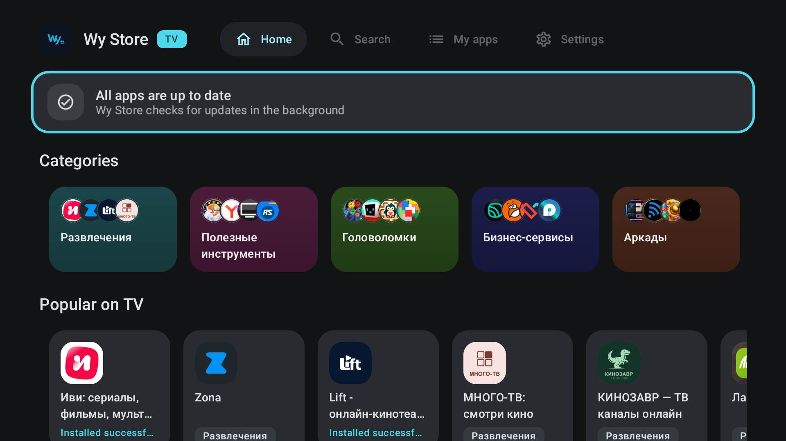
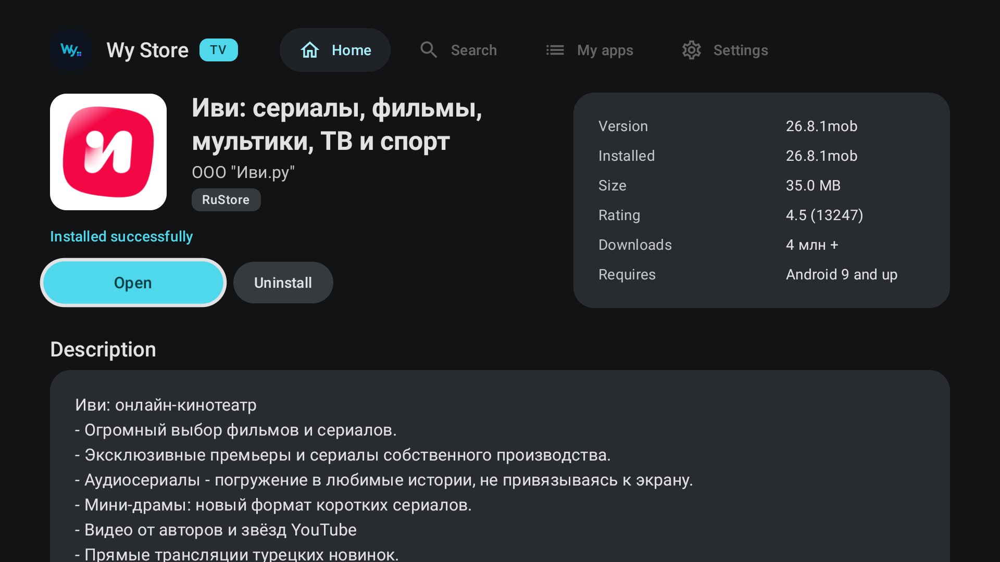
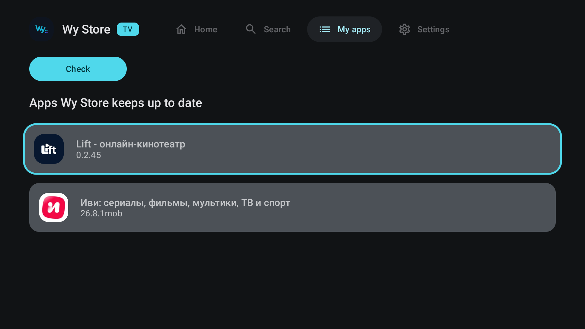

<div align="center">


**没有跟踪与广告的 RuStore 替代品**

[](https://github.com/wyrtensi/wystore/releases/latest/download/wystore.apk)
[](https://github.com/wyrtensi/wystore/releases)

[](https://github.com/wyrtensi/wystore/releases/latest)
[](https://github.com/wyrtensi/wystore/actions/workflows/build.yml)
[](#系统要求)
[](https://t.me/+_YytpJdDHgQ4OTYy)
[](LICENSE)

[项目网站](https://wystore.ru/zh/)

[Русский](README.md) · [English](README.en.md) · [Українська](README.uk.md) · [Беларуская](README.be.md) · [Қазақша](README.kk.md) · [Oʻzbekcha](README.uz.md) · [Latviešu](README.lv.md) · **简体中文**

[版本发布](https://github.com/wyrtensi/wystore/releases) · [更新日志](CHANGELOG.md) · [隐私](PRIVACY.md) · [安全](SECURITY.md) · [项目声明](DISCLAIMER.md) · [许可证](LICENSE)

</div>

Wy Store 是 RuStore 目录的 Android 客户端。它展示的应用和 RuStore 应用商店提供的一样，但由它自己通过 Android 系统的软件包安装器下载和安装，既不需要账号，也不需要 RuStore 客户端。第二个来源是 GitHub 上的 release，因此列表里也会有 RuStore 没有收录的东西。

项目没有服务端、没有账号、没有统计分析、没有广告。应用只访问 `rustore.ru`、`github.com` 以及这些服务自己分发文件所用的存储。

这个目录面向俄罗斯的用户，所以其中大部分内容是俄语的；界面本身提供七种语言。

Wy Store 与 RuStore 没有隶属关系，也不代表它行事：RuStore 在这里只是数据源。详见 [DISCLAIMER.md](DISCLAIMER.md)。

| 主页 | 应用页面 | 库 |
|---|---|---|
|  |  |  |

[逐屏介绍](https://telegra.ph/Wy-Store-magazin-prilozhenij-kotoryj-ne-prosit-vojti-v-akkaunt-09-09) —— 一个屏幕一个屏幕地看这个应用，以及其中哪些地方并不总是能正常工作（俄语）。

## 功能

- **一个列表里的两个来源。** RuStore 的条目和精选 GitHub 项目的 release 在搜索、主页和分区里并列显示，每一条都标明来源。任何公开仓库都可以用链接添加。
- **目录分区。** RuStore 的分区以磁贴形式出现在主页上，也有单独的全部分区页面。在设置里可以改用 Wy Store 自己的一套分区。
- **安装前的 APK 检查。** 在文件交给安装器之前，会核对包名、versionCode、split-APK 组合是否完整以及签名证书。不一致就是拒绝，并说明原因。
- **后台更新。** 按计划检查，并自动下载检查到的内容。在 Android 12 及更高版本上，对于 Wy Store 自己安装的应用，可以不弹对话框直接安装 —— 但这不是必然的，详见下文。
- **下载队列。** 保存在数据库中，能挺过重启和断网，并用 HTTP Range 从中断的位置继续。
- **评价与评分。** 对 RuStore 的应用：评分、按星级的分布，以及按评分的筛选。
- **库。** 已安装的应用，可按来源筛选；在同一个列表里更新和卸载。
- **备份。** 把设置、已接管的应用和已添加的仓库导出、导入为单个 JSON 文件。
- **流量控制。** 后台下载的「仅 Wi-Fi」模式；通过移动数据手动下载时会先请求确认。
- **Android TV。** 同一个 APK 可以在 Android TV 和 Google TV 上运行，有适合遥控器的专用界面和 RuStore 的电视目录。详见 [Android TV](#android-tv) 一节。
- **可选的 root。** 授予 root 后，首次安装、更新和卸载都不会出现 Android 的窗口，在后台也一样。默认关闭；详见 [Root](#root) 一节。
- **界面。** Русский、English、Українська、Беларуская、Қазақша、Oʻzbekcha、Latviešu、简体中文，浅色和深色主题，Material You。

## Android TV

| 首页 | 应用页面 | 我的应用 |
|---|---|---|
|  |  |  |

没有单独的构建：同一个 APK 可以装在 Android 9 及更高版本的 Android TV 和 Google TV 上，并出现在电视的启动器里。设备类型会自动识别；如果电视盒子被识别成了手机，可以在 **设置 → 外观 → 设备类型**（自动、手机、电视）里手动选择。

- **用遥控器操作。** 菜单是顶部的标签页 —— 首页、搜索、我的应用、设置；Wy Store 名称旁边有「电视」标记。「返回」键一层层往外走：从内容回到菜单，从菜单回到首页，在首页则退出。返回之后，焦点停在刚才打开的那张卡片上。
- **首页。** 更新卡片、分区磁贴、按分区排列的行，以及「来自 GitHub」一行。电视上没有通知，所以可以安装或更新的应用集中在首页顶部的一行里。
- **应用页面。** 电视版截图和评价。
- **搜索。** 可以打字，也可以用语音。结果来自电视目录；如果开启了手机目录，还来自整个 RuStore，外加 GitHub。
- **目录。** RuStore 为电视提供单独的目录。**「电视上的目录」** 设置：「电视应用」（默认）、「手机应用」或「两者」。在「两者」模式下，手机应用单独成行，并标有「手机应用」：它们很多并不是为遥控器设计的。无论选哪一项，从任一目录安装的应用都会继续得到更新。
- **GitHub。** 手机和电视上都有 GitHub 目录；可以在 **设置 → 应用来源** 里关闭。

## 安装

1. 从[最新发布](https://github.com/wyrtensi/wystore/releases/latest)下载 `wystore-<version>.apk`。
2. 打开这个文件。Android 会就从此来源安装询问一次权限。
3. 之后 Wy Store 会自己更新自己：它会关注这个仓库里的 release。

每个 release 都带两个文件，`wystore-<version>.apk` 和 `wystore.apk`。它们是同一个构建、同一个签名；第二个是为了让固定链接 `releases/latest/download/wystore.apk` 一直可用。

APK 用一个固定的密钥签名，CI 在每次发布时都会打印它的指纹。检查你下载的文件：

```bash
apksigner verify --print-certs wystore-<version>.apk
```

### 安装到电视

用文件管理器把 APK 下载到电视上，或者从电脑安装：

```bash
adb install wystore.apk
```

在电视上直接安装时，Android 会就安装未知应用询问一次权限。

### 从更早的版本升级到 0.2.0

0.2.0 版把应用 id 从 `dev.wystore` 改成了 `app.wystore`。对 Android 来说这是另一个应用，所以这一次更新必须手动安装：

1. 在旧的 Wy Store 里：**设置 → 备份与迁移 → 导出**，保存文件。
2. 安装新的 APK。
3. 在新的 Wy Store 里：**设置 → 备份与迁移 → 导入**，选择那个文件。设置、已接管的应用和已添加的 GitHub 仓库都会带过来。
4. 卸载旧版本，否则两个商店会追同一批更新。
5. 重新给新应用电池优化豁免，并在第一次更新时确认更新权的移交：两者都和应用 id 绑定，不会迁移过来。

从此以后自更新和以前一样工作。

## 更新如何工作

找到更新并把它下载下来，应用总能自己完成。而一次点击都不用就把它装上，则不是在哪里都行得通，这值得给出一个准确的答案，因为路上有两道确认，而且它们彼此独立。

### 第一道：Android 自己的安装器

从 Android 12 开始，系统允许安装某个应用的一方在更新它时不显示系统对话框。条件有四条，要么全部成立，要么全部不成立：

- 这是更新，不是首次安装；
- Wy Store 被记录为该应用的安装来源；
- 被更新的应用面向 API 33（Android 13）或更高版本；
- 该应用的更新权不属于别人 —— 比如 Google Play。

条件成立时，系统对话框根本不会出现。在 Android 9、10 和 11 上，没有任何第三方商店能做到这一点，RuStore 也一样。Google Play 在任何版本上都能做到 —— 不是靠什么技巧，而是因为它是持有 `INSTALL_PACKAGES` 的特权系统应用，而这个权限普通应用永远拿不到。

### 第二道：Google Play Protect

在装有 Google 服务的手机上，Play Protect 会检查每一个它没见过的 APK，并在任何静默安装之上弹出**它自己的**对话框 ——「把这个应用发送给 Google 做安全扫描」。它会一直等着点击；在得到回应之前，什么都装不上。

Play Protect 记住的是文件，不是应用：同一个 APK 第二次就会静默通过。这在实践中意味着：一个不知名应用的新构建，几乎必然会向早期拿到它的人发问，而 Google 已经见过的热门应用则不会。在没有 Google 服务的手机上，这一步根本不存在。

这不是推理，而是设备实际的表现。在 Android 16 上验证过：更新时系统对话框一次都没有出现过，而 Play Protect 的对话框对每一个新文件都会出现，对任何已经检查过的文件都不出现。

### 不加修饰的结论

- **有 root** —— 一切安装都不出现 Android 的窗口，首次安装也包括在内：安装以 root 身份通过 `pm` 进行，绕过系统安装器的对话框。在装有 Google 服务的设备上，Play Protect 仍然可能检查它没见过的文件。root 默认是关闭的。
- **没有 root** —— 看情况。通常能用，但没有保证：最终决定权在 Play Protect 手里，而它取决于 Google 有没有见过那个具体的文件。

无论哪种情况下载都会发生，而且不问任何问题。需要点击的地方，点击确认的是安装 —— 它不会重新开始下载。

### 这条链路背后的设置

三项默认都是开启的：

| 设置 | 作用 |
|---|---|
| 立即下载更新 | 找到的更新会自己开始下载。后台检查会遵守「仅 Wi-Fi」模式。 |
| 下载完成后立即安装 | 下载好的更新不需要再点一次就进入安装器。 |
| 更新时不询问 | 在系统允许的地方，请求系统跳过它的对话框。 |

### Root

root 不是必需的，默认关闭。开启方法：**设置 → 权限中心 →「检查 Root」**。root 管理器（Magisk、KernelSU 等）会弹出自己的请求 —— 把权限授予 Wy Store（`app.wystore`）。卡片会显示「可用」，被拒绝时显示「未授予」。`su` 会在设备存放它的位置查找：`PATH`、`/system/bin`、`/system/xbin`、`/sbin`、`/su/bin`、`/debug_ramdisk`；只有 `id` 报告 uid 0 时，才算已授予 root。KernelSU 有单独的说明 —— [KERNELSU_ROOT_RU.md](KERNELSU_ROOT_RU.md)（俄语）。

开关在设置的「后台更新」分组里，只在 root 已授予时起作用：

| 设置 | 作用 |
|---|---|
| Root 静默安装 | 首次安装和更新，无论来自 RuStore 还是 GitHub，都以 root 身份通过 `pm` 进行，不出现 Android 的窗口。Wy Store 会被记录为应用的安装来源，在 Android 14 及更高版本上还会被记录为更新所有者，和通过对话框安装时一样。应用显示为由 Wy Store 安装，照常获得更新。 |
| Root 静默卸载 | 默认关闭。「卸载」按钮会立即通过 root 卸载应用，没有任何确认 —— 连同它的数据一起，不做询问。如果此时 root 未授予，会打开 Android 普通的卸载窗口。 |
| 在后台下载更新（root） | 即使「发现更新就下载」已关闭，按计划进行的后台检查也会下载更新。 |

有 root 时，后台检查会在 Wy Store 关闭的情况下自己找到更新、下载并通过 root 安装，一次点击都不需要。

如果 root 被撤销，「检查 Root」会显示「未授予」，静默安装会关闭，安装回到 Android 的窗口。

什么时候会调用 `su` —— 如果权限不是永久授予的，root 管理器可能每次都会询问：

- 点击「检查 Root」时；
- 启动时，如果开启了静默安装或静默卸载；
- 在后台检查中 —— 仅当「发现更新就下载」关闭而「在后台下载更新（root）」开启时；
- 安装和卸载时，如果开启了对应的开关。

目录、搜索和应用页面从不请求 root。

### 其他限制

- 首次安装总是要确认的 —— root 模式除外。
- 由其他商店安装的应用，更新时要确认。可以在应用自己的页面上把它的更新权交给 Wy Store：会覆盖安装一次，需要确认一次，之后 Wy Store 就成为记录在案的安装来源。
- 如果目录里的版本低于已安装的版本，或者应用用另一个密钥签名，那就根本没有任何东西能覆盖安装上去 —— Android 会拒绝。这时应用会提议先卸载再重新安装；在这个过程中应用的数据通常会丢失。
- 从 Google Play 安装的应用不会被碰，除非针对某个具体应用启用了这一点。

## 安全

- 安装之前：包名、versionCode、组合里恰好有一个 base APK，以及签名证书。对于已经安装的应用，签名会和已安装的副本比对，而且 versionCode 必须递增。
- 下载被限制在一份主机白名单内，重定向会被显式解析。
- 下载下来的 APK 放在应用的私有存储里，并按你设定的保留时长和大小上限清除。
- 静默安装不会削弱任何检查：带有外来签名的 APK 在那里同样会被拒绝。

Wy Store 校验的是分发过程，而不是应用本身。已安装的程序做了什么，是它的开发者的事，而每个页面都写明了来源。

发现漏洞了？[SECURITY.md](SECURITY.md) 说明了什么算漏洞、往哪里发送，以及为什么不要发到公开的 issue。

## 隐私

- 没有账号、没有注册、没有登录。
- 没有统计分析、广告 SDK 或崩溃上报。
- 没有服务端：请求直接发往 RuStore 和 GitHub，中间没有任何东西。
- 客户端把自己标识为 `WyStore/<version>`，并且从不创建 RuStore 的 `User-Token`。
- 应用保存的一切都留在设备上。备份按你的命令创建，并保存到你指定的地方。

完整文本在 [PRIVACY.md](PRIVACY.md)。

## 权限

| 权限 | 用途 |
|---|---|
| `INTERNET`、`ACCESS_NETWORK_STATE` | 获取目录和 APK，为「仅 Wi-Fi」模式检查网络类型 |
| `REQUEST_INSTALL_PACKAGES` | 安装下载下来的 APK |
| `UPDATE_PACKAGES_WITHOUT_USER_ACTION`、`ENFORCE_UPDATE_OWNERSHIP` | 不弹对话框更新 Wy Store 自己安装的应用 |
| `REQUEST_DELETE_PACKAGES` | 从库里卸载 |
| `QUERY_ALL_PACKAGES` | 把目录和已安装的内容对应起来：版本、状态、可用更新 |
| `POST_NOTIFICATIONS` | 关于找到的更新和下载进度的通知 |
| `FOREGROUND_SERVICE`、`FOREGROUND_SERVICE_DATA_SYNC`、`RUN_USER_INITIATED_JOBS` | 系统不会中途杀掉的下载 |
| `RECEIVE_BOOT_COMPLETED` | 重启后恢复检查计划 |
| `REQUEST_IGNORE_BATTERY_OPTIMIZATIONS` | 可选请求：没有这个豁免，后台检查会在系统高兴的时候才来 |

## 数据源及其限制

应用读取的是 RuStore 的公开 web 端点 —— 和网站给浏览器的东西一样。那不是受支持的客户端 API，它可能在不做通知的情况下改变。这部分集成被隔离在 `RuStoreSource` 里，所以源那边的改动表现为格式错误，而不是目录里损坏的数据。

支持免费应用。付费应用、应用内购买以及任何需要登录 RuStore 的东西都不支持。

端点、HTTP 419 的原因以及回退行为的说明在 [docs/RUSTORE_API_COMPATIBILITY_RU.md](docs/RUSTORE_API_COMPATIBILITY_RU.md)（俄语）。

## 系统要求

- **Android 9.0（API 28）**或更高版本。这是 Wy Store 自己的最低要求；目录里的应用往往需要更新的版本，而每个应用的页面都会在下载之前而不是之后写明它需要的版本。
- 安装未知应用的权限：Android 会在首次安装时请求它。
- root 是可选的。没有它时，不经确认的安装只对更新有效，只在 Android 12 及更高版本上有效，而且只在 Play Protect 不出手阻止的期间有效。有 root 时一切安装都不出现 Android 的窗口，首次安装也包括在内，卸载也可以选择不经确认。细节见「更新如何工作」。
- **Android TV 和 Google TV**，Android 9 及更高版本 —— 用同一个 APK。电视上没有通知，可以安装的内容显示在首页上。
- ABI 和屏幕密度会被自动识别，并选出匹配的 APK 组合。

## 常见问题

**需要 RuStore 账号吗？** 不需要。应用既不会创建账号，也不会使用账号。

**Wy Store 能取代 RuStore 客户端吗？** 就安装和更新免费应用而言，可以。付费内容和购买仍然归官方客户端。

**如果卸载 Wy Store，已安装的应用会怎样？** 不会怎样：它们是系统装上去的，会留在原处。只是自动更新会停止。

**为什么需要已安装软件包的列表？** 为了在目录里显示真实的状态 —— 已安装、有可用更新、版本一致。这个列表从不发送到任何地方。

**可以添加我自己的 GitHub 仓库吗？** 可以，在 GitHub 分区里用链接添加。release 按规则挑选：滚动的 nightly 标签和没有可用 APK 的 release 会被跳过。

## 构建

需要 JDK 17 或更高版本以及 Android SDK Platform 36。

```bash
./gradlew :app:assembleDebug
```

APK 会出现在 `app/build/outputs/apk/debug/app-debug.apk`。

测试：

```bash
./gradlew :app:testDebugUnitTest
```

插桩测试，需要连接设备或模拟器：

```bash
./gradlew :app:connectedDebugAndroidTest
```

### 发布签名

签名检查同样适用于 Wy Store 自己，所以你在本地构建的版本不会被已发布的 release 更新，反之亦然：对 Android 来说它们是不同的应用。

创建密钥（`keytool` 会自己询问密码 —— 不要写在命令里）：

```bash
keytool -genkeypair -v -keystore outputs/wystore-release.jks -alias wystore -keyalg RSA -keysize 4096 -validity 10000
```

签名数据来自仓库根目录的 `keystore.properties`（被 gitignore；模板见 [keystore.properties.example](keystore.properties.example)），或者来自环境变量 `WYSTORE_KEYSTORE`、`WYSTORE_KEYSTORE_PASSWORD`、`WYSTORE_KEY_ALIAS`、`WYSTORE_KEY_PASSWORD`。四个都是必需的：缺少其中任何一个，release 构建都会保持未签名，而不是悄悄用 debug 密钥签名。

### 发布

先在 [CHANGELOG.md](CHANGELOG.md) 里写上新版本号下的条目，然后才打标签。GitHub release 的正文取自那一节，而没有对应条目的标签会让构建失败。

```bash
git tag v0.2.0 && git push origin v0.2.0
```

CI 会按标签构建 release —— [.github/workflows/release.yml](.github/workflows/release.yml)。仓库 secrets 里必须有 `WYSTORE_KEYSTORE_BASE64`（base64 形式的密钥文件）、`WYSTORE_KEYSTORE_PASSWORD`、`WYSTORE_KEY_ALIAS` 和 `WYSTORE_KEY_PASSWORD`。workflow 会验证 APK 已签名，没签名就失败。

CI secrets 里的签名密钥，任何能修改这个仓库里 workflow 的人都能拿到。如果这不可接受，就在本地构建 release 并手动上传 APK。

## 项目结构

| 路径 | 里面是什么 |
|---|---|
| `app/src/main/java/dev/wystore/data` | 源、目录、模型、APK 校验 |
| `app/src/main/java/dev/wystore/updates` | 下载队列、安装、调度器 |
| `app/src/main/java/dev/wystore/background` | Worker、通知与电池策略 |
| `app/src/main/java/dev/wystore/selfupdate` | Wy Store 自身的更新 |
| `app/src/main/java/dev/wystore/localization` | 把带类型的错误码转成文本 |
| `app/src/main/java/dev/wystore/ui` | Compose 界面、主题、共用组件 |
| `app/src/test` | 单元测试，包括从源那里抓取的 HTML fixture |
| `app/src/androidTest` | 插桩测试 |

源码树仍然是 `dev/wystore`：那是 Java 包的命名空间。Android 应用 id 是单独设置的，为 `app.wystore`。

## 反馈

缺陷和建议请发到 [Issues](https://github.com/wyrtensi/wystore/issues)；讨论在 [Telegram 交流群](https://t.me/+_YytpJdDHgQ4OTYy)里进行。

附上诊断报告会让缺陷报告更容易处理：**设置 → 关于 → 诊断报告**。它包含 Android 版本、设备型号、root 和权限状态、队列以及最近的失败 —— 没有账号、没有链接、没有文件路径。

## 许可证

MIT，见 [LICENSE](LICENSE)。
